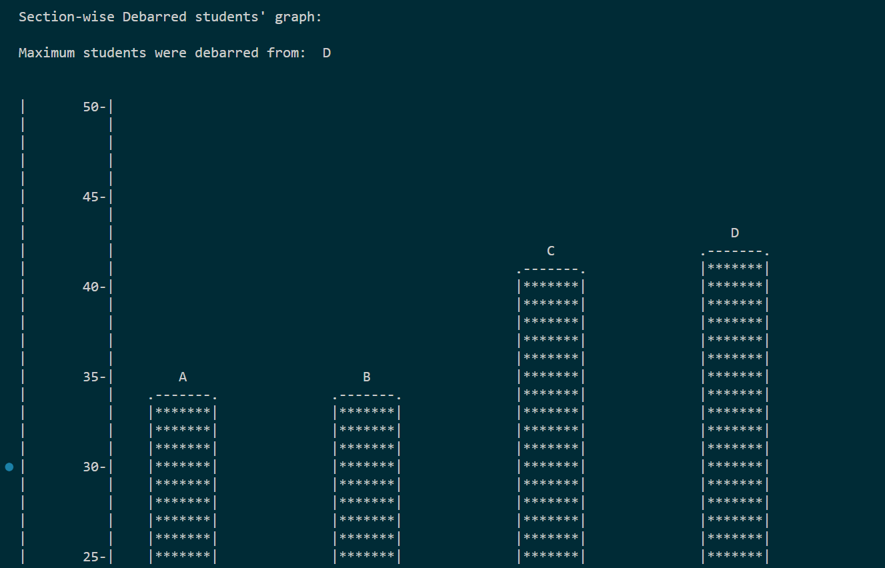

# Sem-Debarred-List-Processor

Some File handling and basic data representations performed on the list of the students debarred from 5th sem exam. 

Disclaimer: This made this only to learn and practice, not taking it personally is appreciated.

## Setup

In your local development environment, clone the repo and at the root directory path, run command -

```bash
    npm run dev
```

## Bar Graph

The bar graph will look like -

